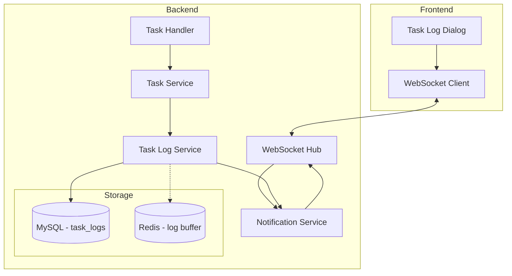

# Design Document: Real-time Task Logs

## Overview

本设计文档描述了实时任务日志系统的技术架构和实现方案。该系统将扩展现有的 WebSocket 通知服务，增加任务日志的实时推送能力，同时增强历史日志的查询和管理功能。

核心设计原则：
1. **复用现有架构** - 基于现有的 `NotificationService` 和 `WSHub` 扩展，避免重复建设
2. **最小侵入性** - 尽量减少对现有代码的修改
3. **可靠性优先** - 确保日志先持久化再推送，不丢失数据
4. **性能考虑** - 支持高并发日志写入和推送

## Architecture



### 数据流

1. **日志创建流程**:
   - Task Executor 调用 `LogService.CreateLog()`
   - LogService 将日志写入 MySQL
   - LogService 通过 NotificationService 推送给订阅者
   - WSHub 将日志分发给订阅该任务的客户端

2. **日志订阅流程**:
   - 前端打开日志对话框
   - WebSocket 客户端发送 `subscribe_task_logs` 消息
   - WSHub 将客户端添加到任务的订阅列表
   - 返回最近 50 条日志作为初始数据

## Components and Interfaces

### 1. TaskLogService (新增)

```go
// TaskLogService 任务日志服务接口
type TaskLogService interface {
    // 创建日志并推送
    CreateLog(ctx context.Context, log *TaskLogEntry) error
    
    // 批量创建日志
    BatchCreateLogs(ctx context.Context, logs []*TaskLogEntry) error
    
    // 查询日志（支持分页和过滤）
    QueryLogs(ctx context.Context, filter *LogQueryFilter) (*LogQueryResult, error)
    
    // 获取任务最近的日志
    GetRecentLogs(ctx context.Context, taskID uint64, limit int) ([]*TaskLogEntry, error)
    
    // 清理过期日志
    CleanupExpiredLogs(ctx context.Context, retentionDays int) (int64, error)
    
    // 删除任务相关日志
    DeleteTaskLogs(ctx context.Context, taskID uint64) error
}
```

### 2. NotificationService 扩展

```go
// 新增方法
type NotificationService interface {
    // ... 现有方法 ...
    
    // 订阅任务日志
    SubscribeTaskLogs(userID uint64, taskID uint64) error
    
    // 取消订阅任务日志
    UnsubscribeTaskLogs(userID uint64, taskID uint64) error
    
    // 推送任务日志
    PushTaskLog(userID uint64, taskID uint64, log *TaskLogEntry) error
    
    // 获取任务的订阅者列表
    GetTaskLogSubscribers(taskID uint64) []uint64
}
```

### 3. WebSocket 消息协议

```typescript
// 订阅任务日志
interface SubscribeTaskLogsMessage {
    type: "subscribe_task_logs";
    task_id: number;
}

// 订阅成功响应
interface SubscribeSuccessMessage {
    type: "subscribe_task_logs_success";
    task_id: number;
    initial_logs: TaskLogEntry[];
}

// 实时日志推送
interface TaskLogMessage {
    type: "task_log";
    task_id: number;
    log: TaskLogEntry;
}

// 取消订阅
interface UnsubscribeTaskLogsMessage {
    type: "unsubscribe_task_logs";
    task_id: number;
}
```

### 4. REST API 扩展

```
GET /api/v1/tasks/:id/logs
    Query Parameters:
    - page: int (default: 1)
    - limit: int (default: 50, max: 200)
    - level: string (info|warn|error|debug)
    - start_time: timestamp
    - end_time: timestamp
    - account_id: uint64
    - order: string (asc|desc, default: asc)
    
    Response:
    {
        "code": 0,
        "data": {
            "logs": [...],
            "total": 100,
            "page": 1,
            "limit": 50,
            "has_more": true
        }
    }
```

## Data Models

### TaskLogEntry (增强)

```go
type TaskLogEntry struct {
    ID        uint64          `json:"id" gorm:"primaryKey;autoIncrement"`
    TaskID    uint64          `json:"task_id" gorm:"not null;index:idx_task_created"`
    AccountID *uint64         `json:"account_id" gorm:"index"`
    Level     LogLevel        `json:"level" gorm:"type:enum('info','warn','error','debug');default:'info'"`
    Action    string          `json:"action" gorm:"size:50;not null"`
    Message   string          `json:"message" gorm:"type:text"`
    ExtraData json.RawMessage `json:"extra_data" gorm:"type:json"`
    CreatedAt time.Time       `json:"created_at" gorm:"index:idx_task_created"`
}

type LogLevel string

const (
    LogLevelInfo  LogLevel = "info"
    LogLevelWarn  LogLevel = "warn"
    LogLevelError LogLevel = "error"
    LogLevelDebug LogLevel = "debug"
)
```

### LogQueryFilter

```go
type LogQueryFilter struct {
    TaskID    uint64
    AccountID *uint64
    Level     *LogLevel
    StartTime *time.Time
    EndTime   *time.Time
    Page      int
    Limit     int
    Order     string // "asc" or "desc"
}
```

### LogQueryResult

```go
type LogQueryResult struct {
    Logs    []*TaskLogEntry `json:"logs"`
    Total   int64           `json:"total"`
    Page    int             `json:"page"`
    Limit   int             `json:"limit"`
    HasMore bool            `json:"has_more"`
}
```

### TaskLogSubscription (内存结构)

```go
type TaskLogSubscription struct {
    TaskID      uint64
    Subscribers map[uint64]*WSConnection // userID -> connection
    mutex       sync.RWMutex
}
```

## Correctness Properties

*A property is a characteristic or behavior that should hold true across all valid executions of a system-essentially, a formal statement about what the system should do. Properties serve as the bridge between human-readable specifications and machine-verifiable correctness guarantees.*

### Property 1: Log Persistence Before Push
*For any* log entry that is pushed via WebSocket, the log entry SHALL already exist in the database.
**Validates: Requirements 7.4**

### Property 2: Subscription Round-Trip
*For any* client that subscribes to a task's logs and then unsubscribes, the client SHALL be removed from the subscriber list and no longer receive logs for that task.
**Validates: Requirements 2.1, 2.2**

### Property 3: Log Delivery to Subscribers
*For any* log entry created for a task with active subscribers, all subscribers SHALL receive the log entry.
**Validates: Requirements 1.2**

### Property 4: Initial Logs on Subscribe
*For any* subscription to a task's logs, the initial response SHALL contain at most 50 of the most recent log entries for that task.
**Validates: Requirements 2.5**

### Property 5: Log Query Filtering
*For any* log query with filters (level, time range, account_id), all returned logs SHALL match all specified filter criteria.
**Validates: Requirements 3.2, 3.3, 3.4**

### Property 6: Log Query Pagination
*For any* log query with pagination parameters, the number of returned logs SHALL not exceed the specified limit, and the limit SHALL not exceed 200.
**Validates: Requirements 3.1**

### Property 7: Log Query Ordering
*For any* log query, the returned logs SHALL be ordered by created_at in the specified order (ascending by default).
**Validates: Requirements 3.5**

### Property 8: Log Level Validation
*For any* log entry creation, the level field SHALL be one of: info, warn, error, debug. Invalid levels SHALL be rejected.
**Validates: Requirements 4.2, 4.4**

### Property 9: Log Entry Structure
*For any* log entry, it SHALL contain all required fields: id, task_id, level, action, message, created_at.
**Validates: Requirements 4.1**

### Property 10: Task Completion Log
*For any* task that completes or fails, there SHALL be a final log entry with action indicating the completion status.
**Validates: Requirements 1.5**

### Property 11: Disconnect Cleanup
*For any* client that disconnects, the client SHALL be removed from all task log subscriber lists.
**Validates: Requirements 2.3**

### Property 12: Task Deletion Cascades to Logs
*For any* task that is deleted, all associated log entries SHALL be deleted.
**Validates: Requirements 6.3**

### Property 13: Log Retention Cleanup
*For any* log entry older than the retention period, it SHALL be deleted during the cleanup process.
**Validates: Requirements 6.1**

## Error Handling

### WebSocket Errors

1. **Connection Lost**
   - 前端自动尝试重连（指数退避，最大 30 秒）
   - 重连成功后自动重新订阅之前的任务日志

2. **Invalid Task ID**
   - 返回错误消息：`{"type": "error", "message": "Task not found or access denied"}`

3. **Subscription Limit Exceeded**
   - 每个用户最多同时订阅 10 个任务的日志
   - 超出时返回错误：`{"type": "error", "message": "Subscription limit exceeded"}`

### Database Errors

1. **Log Write Failure**
   - 重试 3 次，使用指数退避
   - 失败后记录到错误日志，不阻塞任务执行

2. **Query Timeout**
   - 设置查询超时为 10 秒
   - 超时返回部分结果或错误

## Testing Strategy

### Unit Tests

1. **LogService Tests**
   - 测试日志创建和验证
   - 测试查询过滤逻辑
   - 测试分页逻辑

2. **Subscription Manager Tests**
   - 测试订阅/取消订阅
   - 测试断开连接清理

### Property-Based Tests

使用 Go 的 `testing/quick` 或 `gopter` 库进行属性测试：

1. **Property 1**: 生成随机日志，验证推送前已持久化
2. **Property 2**: 生成随机订阅/取消订阅序列，验证最终状态
3. **Property 5**: 生成随机过滤条件，验证返回结果符合条件
4. **Property 6**: 生成随机分页参数，验证结果数量限制
5. **Property 7**: 生成随机日志序列，验证排序正确性
6. **Property 8**: 生成随机日志级别，验证验证逻辑

### Integration Tests

1. **WebSocket 集成测试**
   - 测试完整的订阅-推送-取消订阅流程
   - 测试断线重连

2. **API 集成测试**
   - 测试日志查询 API
   - 测试分页和过滤

### 测试配置

- 属性测试最少运行 100 次迭代
- 每个测试用例需要标注对应的设计属性
- 标注格式：`// Feature: realtime-task-logs, Property N: [property description]`
